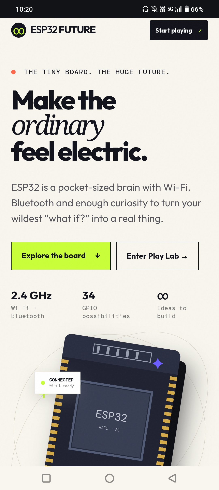
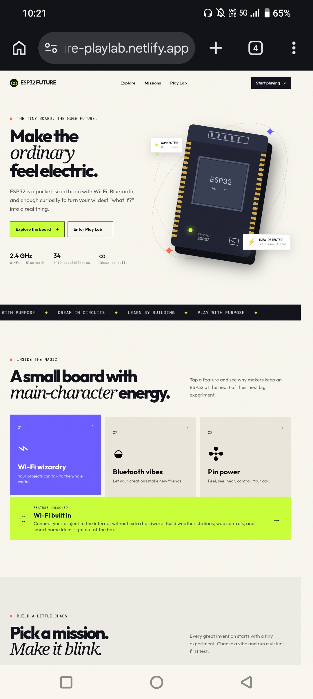
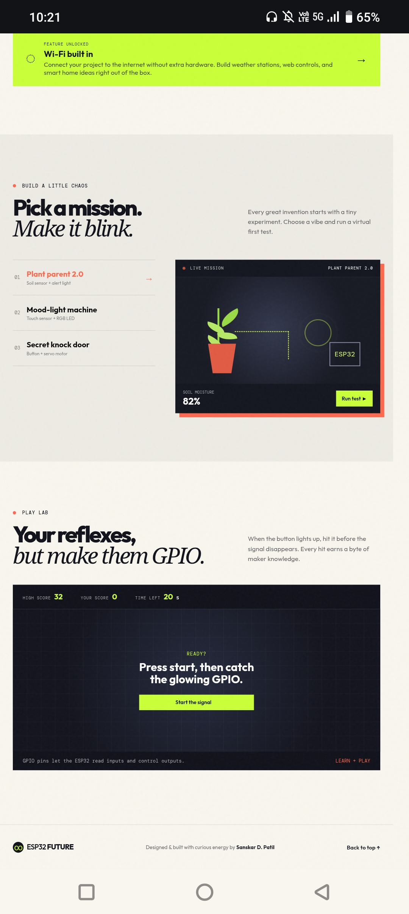

# ⚡ ESP32 Future PlayLab

> **The tiny board. The huge future.**

**ESP32 Future PlayLab** is an interactive web-based learning platform designed to make ESP32 and microcontroller concepts more engaging through **interactive experiments, missions, challenges, and mini-games**.

🌐 **Live Demo:** https://esp32-future-playlab.netlify.app/

📦 **GitHub:** https://github.com/uniqueSanskar23/ESP32-Future-PlayLab

---

## 🚀 About

Learning microcontrollers can become difficult when it's limited to documentation and theory.

ESP32 Future PlayLab takes a more interactive approach by combining:

* 🧠 ESP32 learning concepts
* 🔌 GPIO concepts
* 🧪 Virtual experiments
* 🎯 Practical missions
* 🎮 Interactive mini-games
* 📡 Wi-Fi & Bluetooth concepts
* ⚡ Browser-based challenges

The goal is simple:

> **Explore → Experiment → Understand → Build**

---

## ✨ Features

### 🔍 ESP32 Explorer

Explore fundamental ESP32 capabilities and understand how the microcontroller can be used in connected projects.

Topics include:

* 📡 Wi-Fi
* 🔵 Bluetooth
* 🔌 GPIO
* ⚡ Digital inputs and outputs
* 🧠 Microcontroller fundamentals
* 🌐 IoT concepts

---

### 🧪 Interactive Missions

The platform includes interactive scenarios based on real ESP32 applications.

#### 🌱 Plant Parent 2.0

**Concept:** Soil moisture sensor + indicator

Learn how sensors can monitor environmental conditions and trigger outputs.

#### 🌈 Mood-Light Machine

**Concept:** Touch input + RGB LED

Understand the relationship between inputs, outputs, and interactive lighting.

#### 🚪 Secret Knock Door

**Concept:** Button input + servo motor

Explore how an ESP32 can respond to user input and control a physical actuator.

> These missions currently represent **virtual learning scenarios** rather than physical hardware implementations.

---

## 🎮 Play Lab

### ⚡ GPIO Reflex Challenge

A browser-based reaction game inspired by GPIO signals.

**Features:**

* ⏱️ 20-second gameplay
* 🎯 Reaction-based challenge
* 🏆 High-score tracking
* 💡 Learning information
* 🔌 GPIO-inspired game mechanics

The game combines learning with simple interactive gameplay to make ESP32 concepts more approachable.

---

## 🧠 Learning Approach

### Traditional Learning

```text
Read → Memorize → Code → Forget
```

### Future PlayLab

```text
Explore → Experiment → Play → Understand → Build
```

The project focuses on **learning through interaction and experimentation**.

---

## 🛠️ Technology

The current version is a browser-based web application built with:

* HTML5
* CSS3
* JavaScript
* Interactive UI components
* Browser-based game logic
* Netlify deployment

---

## 📂 Project Structure

```text
ESP32-Future-PlayLab/
├── index.html
├── style.css
├── script.js
├── LICENSE
└── README.md
```

> The structure above represents the current core project files.

---

## 🌐 Run Locally

### 1. Clone the repository

```bash
git clone https://github.com/uniqueSanskar23/ESP32-Future-PlayLab.git
```

### 2. Open the project

```bash
cd ESP32-Future-PlayLab
```

Open `index.html` in a browser.

For development, you can use **VS Code Live Server** or another local development server.

---
## 📸 Project Preview

### 🏠 Home


### 🧪 Missions


### 🎮 GPIO Reflex Challenge


---

## 🎯 Future Development

Planned ideas for future versions include:

* 🧠 ESP32 interactive skill tree
* 🎮 Additional learning games
* 🐛 Code Bug Hunter
* 🔌 Virtual circuit builder
* 📡 Wi-Fi challenges
* 🧩 GPIO puzzles
* 🏆 Achievements and badges
* ⭐ XP and leveling
* 📊 Learning progress dashboard
* 🤖 Interactive ESP32 mascot
* 🧪 More hardware experiments
* 🌐 **Real ESP32 hardware integration**
* 💾 Progress tracking
* 🏆 Leaderboards

> Future features may be added progressively as the project develops.

---

## 🔌 Future Hardware Integration

One of the major planned upgrades is connecting the web platform with a **real ESP32 board**.

Potential architecture:

```text
Web Interface
      ↓
Wi-Fi / Web Communication
      ↓
ESP32
      ↓
GPIO / Sensors / Actuators
      ↓
Real Hardware Response
```

This would extend the project from a browser-based learning platform into an **interactive ESP32 + IoT system**.

---

## 💡 Why ESP32?

ESP32 provides an accessible platform for exploring:

```text
Sensors
   ↓
Microcontrollers
   ↓
Embedded Systems
   ↓
IoT
   ↓
Automation
   ↓
Robotics
   ↓
Connected Devices
```

ESP32 Future PlayLab is designed as a small starting point for exploring that ecosystem.

---

## 🤝 Contributing

Ideas and improvements are welcome.

You can contribute by suggesting or developing:

* New ESP32 missions
* Learning challenges
* Mini-games
* Circuit experiments
* UI improvements
* ESP32-related educational content

### Basic workflow

```bash
git clone https://github.com/uniqueSanskar23/ESP32-Future-PlayLab.git

git checkout -b feature/your-idea
```

Make your changes, test them, and submit a pull request.

---

## 📜 License

This project is released under the **MIT License**.

See the `LICENSE` file for details.

---

## ⭐ Support

If you find ESP32 Future PlayLab useful or interesting:

⭐ Star the repository
🍴 Fork the project
💡 Suggest an idea
🧪 Experiment with it

> **Don't just learn ESP32. Build something with it. ⚡**

---

## 👨‍💻 Author

**Sanskar D. Patil**

Electronics & Computer Engineering Student
Interested in **Embedded Systems, IoT, Electronics & Automation**

**ESP32 Future PlayLab — Learn. Build. Play.**
